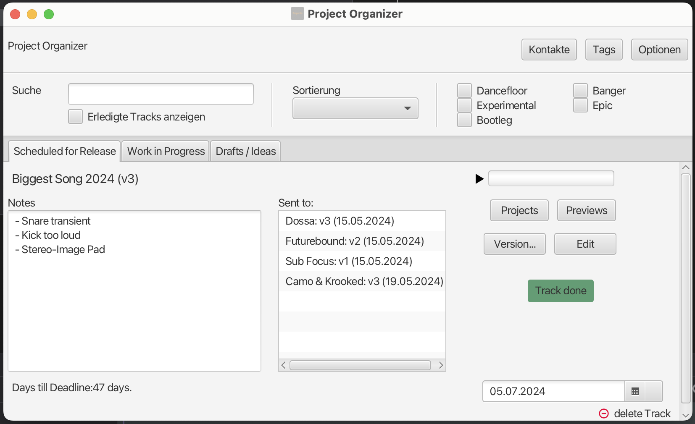

# ProjectOrganizer
Before i got into coding i used to travel around europe as a dj and music producer.

As a musician you start new ideas all the time. If you are not organizing your demos and ideas well, you quickly end up with 
files clustered all around your computer with names like name_idea_2024.mp3, new_track_v7.mp3 etc..

And then if you find the demo-song you have been searching for the past hour, the search goes on to find the corresponding DAW-Project.

One night in 2023 I had this idea of making the ultimate Project Organizing Tool. 
I got up, took a piece of paper and drew some mockups.

In the following 5 days i came up with this application.

`There are some bugs left and the code is not as clean as it could be - i will clean it up once i got some time.`

## About
The idea is to guide you through each step of your workflow: Project Organizer always shows you the most relevant Data at the current stage: from early draft to final tweaks.
You can simply Drag & Drop a MP3 or WAV File and ProjectOrganizer creates a new Project for you.

Add Notes/ToDos, organise your Ideas with your defined Tags, keep track of who you sent your Demos to and more!

Once you start a new draft, just bounce a clip and drag & drop the bounce into this program.
When you are looking for new drafts to finish, you can easily preview your drafts and decide which ones to start working on.
This way no draft gets lost, but you dont have to worry about looking through your file system for projects.
Make sure to Edit the track right now, because now you remember where the project folder is located - an information that may be beneficial in a few months :)

## Track stages
To keep your projects organized (pun intended), i implemented three stages:
- Draft
This is the starting point of each Project. Just a draft/idea that could be worth working on at a later time. 
- Work in Progress
Those are the tracks you are currently working on and plan on actually finishing. The focus is on TODOs, Rating, Tags and keeping track of who has your demo.
- Scheduled for release
Once you got your track signed and/or have an actual release date you should set the Project to this stage. 
Here you can set a deadline and since this is the first page that pops up there should be no distractions.

